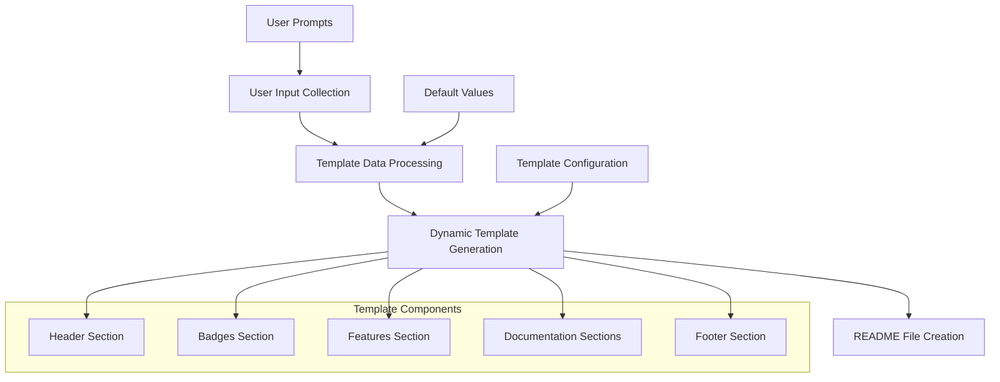

# Design Document

## Overview

This design enhances the Next.js project scaffolder's README template generation by implementing a comprehensive, professional template system. The solution will replace the current basic README template with a dynamic, customizable template that matches modern open-source project standards, including visual branding, comprehensive documentation sections, and user customization capabilities.

## Architecture

### Template System Architecture



### Data Flow

1. **Input Collection**: Gather project-specific information from user
2. **Template Processing**: Merge user data with template structure
3. **Dynamic Generation**: Create customized README content
4. **File Creation**: Write the final README.md file

## Components and Interfaces

### 1. Enhanced README Template Generator

**Location**: `src/templates/readme.js`

```javascript
// Enhanced template function signature
export function createReadmeTemplate(projectData = {}) {
  // Returns customized README content
}
```

**Responsibilities**:
- Generate dynamic README content based on user input
- Handle placeholder replacement
- Maintain consistent formatting and structure
- Support both default and custom values

### 2. User Input Collector

**Location**: `src/utils/userInput.js` (new file)

```javascript
export async function collectProjectData() {
  // Returns object with user-provided project information
}
```

**Responsibilities**:
- Prompt user for project-specific information
- Validate input data
- Provide sensible defaults
- Handle optional fields

### 3. Template Data Processor

**Location**: `src/utils/templateProcessor.js` (new file)

```javascript
export function processTemplateData(userData, defaults) {
  // Returns processed data object for template generation
}
```

**Responsibilities**:
- Merge user data with defaults
- Format data for template consumption
- Handle missing or invalid data
- Generate derived values (like GitHub URLs)

## Data Models

### Project Data Interface

```javascript
const ProjectData = {
  // Basic Information
  projectName: string,
  description: string,
  authorName: string,
  githubUsername: string,
  
  // Visual Elements
  hasPersonalLogo: boolean,
  hasProjectLogo: boolean,
  includeScreenshot: boolean,
  
  // Technical Stack
  technologies: {
    nextjs: string,      // version
    react: string,       // version
    typescript: string,  // version
    tailwind: string,    // version
    license: string      // license type
  },
  
  // Features
  features: string[],    // array of feature descriptions
  
  // Documentation Preferences
  includeUsageSection: boolean,
  includeContributing: boolean,
  includeTechnicalDocs: boolean,
  
  // Project Structure
  customStructure: object, // optional custom folder structure
  
  // Optional Fields
  inspirationalQuote: string,
  additionalBadges: object[],
  customSections: object[]
};
```

### Template Section Interface

```javascript
const TemplateSection = {
  name: string,
  required: boolean,
  content: string,
  order: number,
  dependencies: string[] // other sections this depends on
};
```

## Error Handling

### Input Validation
- **Invalid project names**: Sanitize and suggest alternatives
- **Missing required fields**: Prompt for re-entry with helpful messages
- **Invalid GitHub usernames**: Validate format and provide examples

### Template Generation Errors
- **Missing template data**: Use fallback defaults
- **File writing errors**: Provide clear error messages and recovery options
- **Invalid template syntax**: Log errors and use basic template as fallback

### Recovery Strategies
- Always provide a working README even if customization fails
- Log all errors for debugging
- Offer to retry with different inputs
- Graceful degradation to basic template

## Testing Strategy

### Unit Tests
- Template generation with various input combinations
- Data validation and sanitization
- Error handling scenarios
- Default value application

### Integration Tests
- End-to-end README generation process
- User input collection and processing
- File system operations
- Template customization workflows

### Test Data
- Valid project configurations
- Edge cases (empty inputs, special characters)
- Invalid data scenarios
- Large project configurations

### Test Structure
```
tests/
├── unit/
│   ├── template-generation.test.js
│   ├── data-processing.test.js
│   └── input-validation.test.js
├── integration/
│   ├── readme-creation.test.js
│   └── user-workflow.test.js
└── fixtures/
    ├── sample-project-data.js
    └── expected-outputs.js
```

## Implementation Details

### Template Structure

The enhanced README template will be organized into these main sections:

1. **Header Section**
   - Centered logos (personal and project)
   - Project title and description
   - Technology badges

2. **Content Sections**
   - Features list with emojis
   - Screenshot placeholder
   - Getting started guide
   - Built with section
   - Project structure visualization

3. **Technical Documentation**
   - Data structure definitions
   - Usage examples
   - API documentation (if applicable)

4. **Community Sections**
   - Contributing guidelines
   - License information
   - Browser support
   - Build instructions

5. **Footer**
   - Inspirational quote
   - Attribution and branding

### User Experience Flow

1. **Initial Prompt**: Ask if user wants enhanced README
2. **Basic Information**: Collect project name, description, author
3. **Technical Stack**: Confirm detected technologies and versions
4. **Features**: Allow user to add/modify feature list
5. **Customization**: Optional logo paths, screenshots, custom sections
6. **Generation**: Create and write the customized README
7. **Confirmation**: Show summary of what was created

### Backward Compatibility

- Maintain existing `createReadmeTemplate()` function signature
- Add optional parameter for project data
- Default to current behavior if no data provided
- Gradual migration path for existing users

### Performance Considerations

- Template generation should complete in <100ms
- Minimize file I/O operations
- Cache template components for reuse
- Efficient string manipulation for large templates